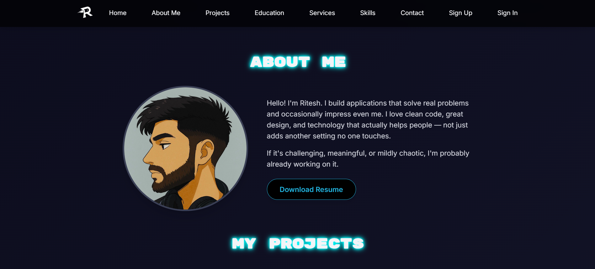
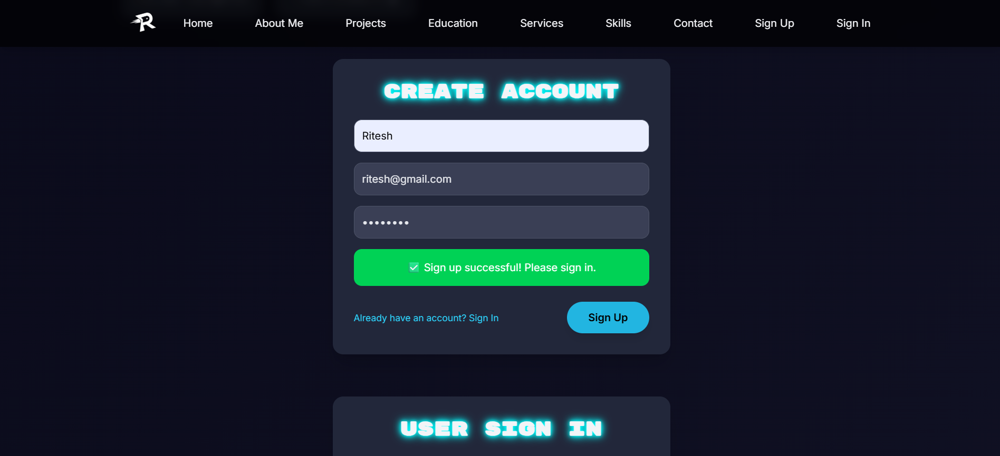
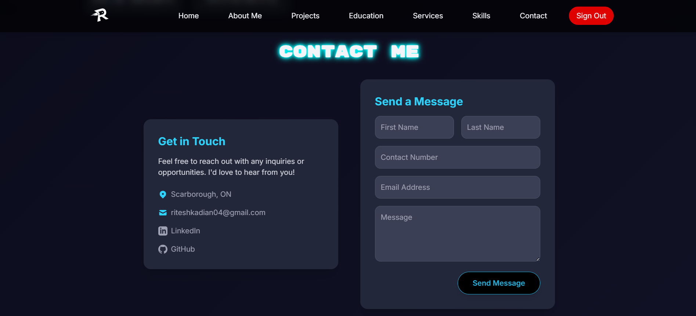

# MyPortfolio (Assignment 2) – Quick Start

## 1) Install
```bash
cp .env.example .env
npm install
```

## 2) Run MongoDB
- Local: start MongoDB service (default port 27017)
- Or edit `.env` to use your Atlas connection string

## 3) Start server
```bash
npm start
```
You should see: `✅ Server on http://localhost:5000`

## 4) Open client
Open `client/index.html` manually in your browser (or with the **Live Server** VS Code extension).
Use the buttons to call the APIs.

## 📸 Preview



